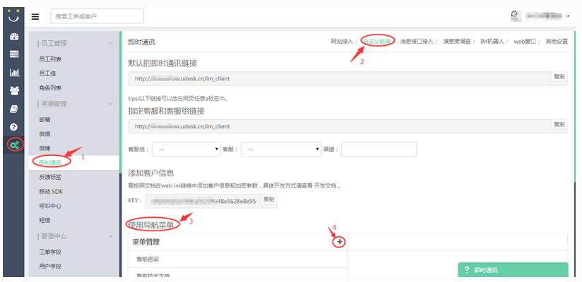
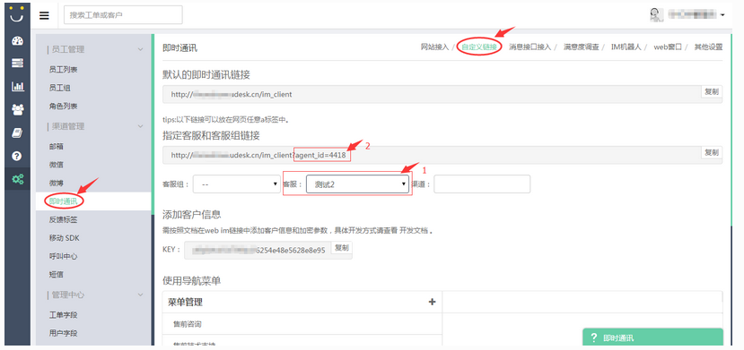
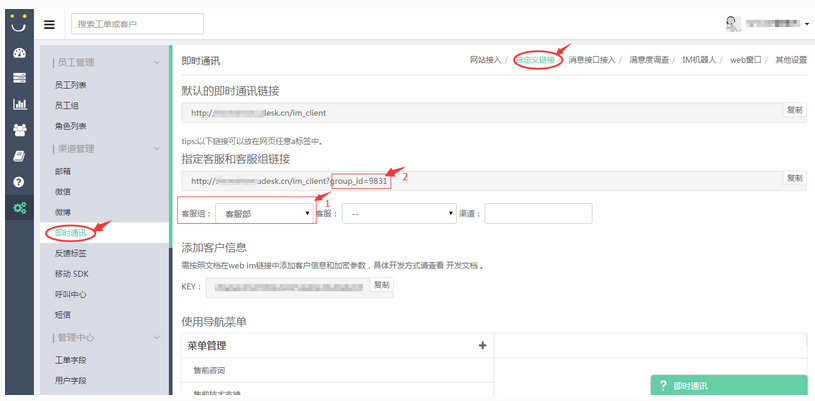

# UdeskSDK-Android
UdeskSDK-Android

##Android新版说明
> Udesk为了让开发者更好的集成移动SDK,与企业业务结合更加紧密，我们开源了SDK的UI界面。用户可以根据自身业务以及APP的不同风格重写页面。当然开发者也可以用我们提供的默认的界面。
##一、接口详细说明
> Udesk-SDK方法都封装在UdeskSDKManager类中,采用单例。通过UdeskSDKManager.getInstance().对应的方法调用。

> **特别注意：第一步必需是调用initApiKey,第二步是必需调用setUserInfo 。 其它的api的使用都必需在第一步和第二步之后,根据集成时的需求调用，否则会出错误。 如果需要在同一个域名和共享密钥下切换用户，则可跳过第一步，直接调用第二步setUserInfo()。**
##1、初始化SDK (必须调用)
####初始化SDK，传入Udesk专属域名和共享的密钥。
initApiKey(Context context,String domain, String secretKey);

> 参数说明

###2、创建用户，上传用户的信息 （必须调用）
> setUserInfo(final Context context,String sdk_Token,Map<String, String> info,Map<String, String> textField,Map<String, String> roplist);

###Info存放用户基本信息示例：
private Map<String, String> getUserInfo() {

        Map<String, String> info = new HashMap<String, String>();
        info.put(UdeskConst.UdeskUserInfo.NICK_NAME,”这是个昵称”);
        info.put(UdeskConst.UdeskUserInfo.EMAIL, "test@163.com");
        info.put(UdeskConst.UdeskUserInfo.CELLPHONE, "13800000000");
        info.put(UdeskConst.UdeskUserInfo.WEIXIN_ID, "这填写微信的ID号");
        info.put(UdeskConst.UdeskUserInfo.WEIBO_NAME, "这是微博的账号");
        info.put(UdeskConst.UdeskUserInfo.QQ, "321321321");
        info.put(UdeskConst.UdeskUserInfo.DESCRIPTION, "这填写的是描述信息");

        return info;

    }
**特别注意：如果需要给用户自定义字段赋值，请先确保已在后台添加用户自定义字段，然后调用接口获取用户自定义字段，再进行赋值。**
####添加用户自定义字段 用管理员账号登录后台，在[管理中心-用户字段]中添加自定义字段。

####调用接口获取用户自定义字段并赋值。
getCustomeUserfields();
####用户自定义字段共有两类：文本型字段和选择型字段。 文本型字段示例：
{
      "field_name": "TextField_684",
      "field_label": "地址",
      "content_type": "text",
      "comment": "字段描述",
      "options": null,
      "permission": 0,
      "requirment": false
    }
####当需要给某一个自定义字段赋值时，取该字段的“field_name”作为key进行赋值。 示例如下：

    extraInfoTextField.put(
            child.getString("field_name"),
            "北京西城区");
####选择型字段示例：
{
    "field_name": "SelectField_457", 
    "permission": 0, 
    "comment": "这是描述", 
    "requirment": true, 
    "content_type": "droplist", 
    "field_label": "性别", 
    "options": [
        {
            "0": "男"
        }, 
        {
            "1": "女"
        }
    ]
}   
####当开发者需要对选择型自定义字段赋值时，同样取"field_name"作为key值，取"options"中的key值作为value赋值。示例如下：
extraInfodRoplist.put(
    child.getString("field_name"),"0");
##3、进入人工客服
####直接进入人工客服界面。系统根据客服分配规则安排客服接待；如果没有在线客服，则提示用户留言。
	public void toLanuchChatAcitvity(Context context){
		Intent intent = new Intent(context, UdeskChatActivity.class);
		context.startActivity(intent);
	}
##4、进入机器人智能客服
####智能选择客服，如果后台开通了机器人客服，则进入机器人会话界面，如果没开通则进入人工客服界面。
showRobotOrConversation( Context context);
##5、进入机器人客服
####进入机器人客服聊天界面。
showRobot(final Context context);

**特别注意：机器人客服需确保后台已开启机器人客服功能及开通“移动SDK”渠道。**
##6、指引客户选择客服组
####管理员在[管理中心-渠道管理-即时通讯-自定义链接-使用导航菜单]中添加自定义菜单，引导客户选择客服组。如果客户选择的客服组没有客服在线时，系统会提示用户留言。

	public void showConversationByImGroup( Context context) {
		Intent intent = new Intent(context, OptionsAgentGroupActivity.class);
		context.startActivity(intent);
	}
##7、指定客服
####开发者可以调用接口指定客服接待用户。如果指定客服不在线，系统会提示用户留言。
    //agentId 客服Id
	public void lanuchChatByAgentId(Context context,String agentId){
		lanuchChatByConfirmId(context, "", agentId);
	}
####客服id获取方式：管理员在[管理中心-渠道管理-即时通讯-自定义链接-指定客服和客服组]中选择指定的客服，这样在上方链接中就会加载指定客服的id。如下图所示，客服“测试2”的agentId是“4418”。

##8、指定客服组
####开发者可以调用接口指定客服组接待用户，如果指定客服组没有在线客服，系统会提示用户留言。
    //groupId 客服组Id
	public void lanuchChatByGroupId(Context context, String groupId){
		lanuchChatByConfirmId(context, groupId, "");
	}
####客服组id获取方式：管理员在[管理中心-渠道管理-即时通讯-自定义链接-指定客服和客服组]中选择指定的客服组，这样在上方链接中就会加载指定客服组的id。如下图所示，客服组“客服部”的groupId是“9831”。

##9、 进入帮助中心
####进入帮助中心界面
	public void toLanuchHelperAcitivty(Context context){
		Intent intent = new Intent(context, UdeskHelperActivity.class);
		context.startActivity(intent);
	}
##10、控制台日志开关
####控制台日志开关，设置true，可看日志，false关闭
isShowLog(boolean isShow);

##11、断开xmpp连接的方法
####sdk 3.2.0版本开始，退出会话界面不在会主动断开xmpp的连接，在收到pc端结束会话的时候，会断开。
	public void disConnectXmpp(){
		UdeskMessageManager.getInstance().cancelXmppConnect();
	}
	
##12、获取当前会话未读消息数
####sdk 3.2.0版本开始，可在退出会话界面后，在本地应用与xmpp服务器连接没断开期间，可获得这个会话的未读消息数。
	public int  getCurrentConnectUnReadMsgCount(){
		return	UdeskDBManager.getInstance().getUnReadMessageCount();
	}
##13、删除客户聊天数据
#### 在调用setUserInfo后，本地的数据库打开后，可进行聊天数据的删除
	public void deleteMsg(){
		UdeskDBManager.getInstance().deleteAllMsg();
	}
##14、获取新消息的通知
#### 在离开会话界面后，没有断开xmpp服务的连接，注册了获取通知消息的方法，获得通知上来的消息。
	注册事件说明 如demo中的注册事件
	
	注册了方法"OnNewMsgNotice"
    UdeskMessageManager.getInstance().event_OnNewMsgNotice.bind(this, "OnNewMsgNotice");
	
	OnNewMsgNotice方法的实现
	public void OnNewMsgNotice(MsgNotice msgNotice) {
        if (msgNotice != null) {
            NotificationUtils.getInstance().notifyMsg(UdeskCaseActivity.this, msgNotice.getContent());
        }

    }
	注意：1 消息上报的对象是：MsgNotice ；2 注册的方法和实现的方法  字符串必须保证一致分大小写；
	      3 实现的方法  必须public修饰。
		  

#二、SDK中使用的Http的接口列表
     > Http 接口已开发实现，不需要再开发。
      "/api/v2/user_fields.json"   获取自定义字段的接口；
	  "/api/v2/customers.json"     创建用户的接口
	  "/api/v2/devices.json"       上传设备信息的接口
	  "/api/v2/im.json"            获取xmpp连接的相关信息的接口
	  "/udesk_im/sdk/v3/im/agent.json"  获取客服信息的接口
	  "/api/v1/articles.json"      获取帮助中心文章列表的接口
	  "/udesk_im/sdk/v3/im/im_survey.json"  获取满意度调查设置内容的接口
	  "/udesk_im/sdk/v3/im/im_group.json"    获取设置客服列表的接口

#三、主要的界面说明
##1、聊天界面UdeskChatActivity中的MessageAdatper
#### 聊天界面的的MessageAdatper： 里面进行展示语音，文本，图片等消息。对应的布局界面：
	 udesk_chat_msg_item_txt_l,//文本消息左边的UI布局文件
	 udesk_chat_msg_item_txt_r,//文本消息右边的UI布局文件
	 udesk_chat_msg_item_audiot_l,//语音消息左边的UI布局文件
	 udesk_chat_msg_item_audiot_r,//语音消息右边的UI布局文件
	 udesk_chat_msg_item_imgt_l,//图片消息左边的UI布局文件
	 udesk_chat_msg_item_imgt_r,//图片消息右边的UI布局文件
	 udesk_chat_msg_item_redirect,//转移消息提示信息UI布局文件
	 udesk_chat_rich_item_txt,//富文本消息UI布局文件
	 udesk_im_commodity_item  //显示广告商品信息的UI布局文件
	 
	 对应的ViewHolder分别是：
	 TxtViewHolder  显示文本消息;
	 AudioViewHolder 显示语音消息；
	 ImgViewHolder    显示图片消息；
	 RichTextViewHolder 显示富文本消息；
	 CommodityViewHolder 显示广告商品信息；
	 RedirectViewHolder  显示转移提示语信息；
	 
##2、启动留言表单界面
#### 当前客服繁忙或者不在线	，输入内容发送消息，弹出留言对话框提示。如果客服点击则跳转到表单
     protected void goToForm() {
		 Intent intent = new Intent(UdeskChatActivity.this,UdeskFormActivity.class);
		 startActivity(intent);
		 dismissFormWindow();
	}
	
	其它对应的UI界面
	UdeskHelperActivity  帮助中心界面；
	UdeskHelperArticleActivity   显示一篇文章的具体内容
    UdeskRobotActivity   机器人会话界面    
	SurvyDialogActivity  满意度对话框
	
##3、自定义View的说明
    UdeskTitleBar 标题栏
	UdeskPopVoiceWindow  录音的弹出框
	UdeskExpandableLayout 提示客服上下线的动画
	UdeskConfirmPopWindow  自定义的含确定取消的PopWindow
	 
#四、兼容Android6.0动态权限说明
	 
	采用开源库rxpermissions 依赖如下库
	compile 'com.tbruyelle.rxpermissions:rxpermissions:0.7.0@aar'
    compile 'io.reactivex:rxjava:1.1.4'
	
	选取rxpermissions 原因是github上目赞和使用最多，使用方便简单。
	举例拍照的使用代码:
	RxPermissions.getInstance(this)
					.request(Manifest.permission.CAMERA, Manifest.permission.WRITE_EXTERNAL_STORAGE)
					.subscribe(new Action1<Boolean>() {
						@Override
						public void call(Boolean aBoolean) {
							if (aBoolean) {
								takePhoto();
								bottomoPannelBegginStatus();
							} else {
								Toast.makeText(UdeskChatActivity.this,
										getResources().getString(R.string.camera_denied),
										Toast.LENGTH_SHORT).show();
							}
						}
					});  
	其它的动态权限可以看UdeskChatActivity代码。

#五、UdeskChatActivity ,ChatActivityPresenter主要功能说明
   > UdeskChatActivity 主要负责界面逻辑的发起和UI的刷新，功能逻辑封装在ChatActivityPresenter中。
##1、处理网络变化的广播
	class ConnectivtyChangedReceiver extends BroadcastReceiver {
		@Override
		public void onReceive(Context context, Intent intent) {
			if (!ConnectivityManager.CONNECTIVITY_ACTION.equals(intent
					.getAction()))
				return;
			boolean bNetWorkAvailabl = UdeskUtils.isNetworkConnected(context);
			if (bNetWorkAvailabl) {
				if (!currentStatusIsOnline && isNeedRelogin) {
					mPresenter.getCustomerId();
				}
			} else {
				isNeedRelogin = true;
				UdeskUtils.showToast(
						context,
						context.getResources().getString(
								R.string.udesk_has_wrong_net));
				setAgentStatus("", View.GONE);
				currentStatusIsOnline = false;
			}
		}
	}
##2、从本地获取历史消息
	/**
	 * 读取数据库中的历史数据
	 * mode 1 表示第一次获取
	 *      2 表示下拉刷新获取
	 */
	private void loadHistoryRecords(int mode)
##3、处理请求客服信息和处理转移客服后的信息
	//处理请求客服信息
	public void dealAgentInfo(AgentInfo agentInfo) 
	//处理转移客服后的信息
	public void dealRedirectAgentInfo(AgentInfo agentInfo)
##4、发送消息 和收消息。
   //发送文本消息
   mPresenter.sendTxtMessage();
   
   //发送图片信息
   mPresenter.sendBitmapMessage
   
   //发送语音消息
   mPresenter.sendRecordAudioMsg(filePath, duration);
   
   //发送输入预支消息
   mPresenter.sendPreMessage();
   
   //发送广告消息
   mPresenter.sendCommodityMessage(commodity);
   
   
   收消息：方法在ChatActivityPresenter中
   
   
   	/**
	 * 收到发送消息的回执
	 */
	public void onMessageReceived(String msgId) {
		if (mChatView.getHandler() != null) {
			Message message = mChatView.getHandler().obtainMessage(
					MessageWhat.changeImState);
			message.obj = msgId;
			message.arg1 = UdeskConst.SendFlag.RESULT_SUCCESS;
			mChatView.getHandler().sendMessage(message);
		}

	}

	/**
	 * 收到新消息
	 */
	public void onNewMessage(MessageInfo msgInfo) {

		if (mChatView.getHandler() != null) {
			Message messge = mChatView.getHandler().obtainMessage(
					MessageWhat.onNewMessage);
			messge.obj = msgInfo;
			mChatView.getHandler().sendMessage(messge);
		}
	}
	

	/**
	 * 收到客服上线下线的通知
	 */
	public void onPrenseMessage(String jid, Integer onlineFlag) {
		if (mChatView.getHandler() != null) {
			Message messge = mChatView.getHandler().obtainMessage(
					MessageWhat.status_notify);
			messge.arg1 = onlineFlag;
			messge.obj = jid;
			mChatView.getHandler().sendMessage(messge);
		}
		
	}

	/**
	 * 收到客服发送邀请评价的消息
	 * @param isSurvey
     */
	public void onReqsurveyMsg(Boolean isSurvey) {

		if(isSurvey){
			getIMSurveyOptions();
		}
	
	}
#五、工程项目的依赖
	compile files('libs/qiniu-android-sdk-7.0.1.jar')
    compile files('libs/universal-image-loader-1.9.4.jar')
    compile files('libs/bugly_crash_release__2.1.jar')
    compile 'org.igniterealtime.smack:smack-android-extensions:4.1.0'
    compile 'org.igniterealtime.smack:smack-tcp:4.1.0'
    compile 'com.tbruyelle.rxpermissions:rxpermissions:0.7.0@aar'
    compile 'io.reactivex:rxjava:1.1.4'
    compile files('libs/android-async-http-1.4.6.jar')
    compile files('libs/udesk_sdk_3.2.0.jar')

#五、混淆忽略设置
-keep class udesk.core.** {*;} 

-keep class cn.udesk.**{*; } 

-keep class com.loopj.android.http.** {*; } 

-keep class com.tencent.bugly.** {*; } 

-keep class com.qiniu.android.** {*;} 

-keep class com.nostra13.universalimageloader.** {*;} 

-keep class org.jxmpp.** {*;} 

-keep class de.measite.** {*;} 

-keep class rx.** {*;} 

-keep class org.jivesoftware.** {*;} 

-keep class org.xmlpull.** {*;} 

-keep classcom.tbruyelle.rxpermissions.** {*;}

