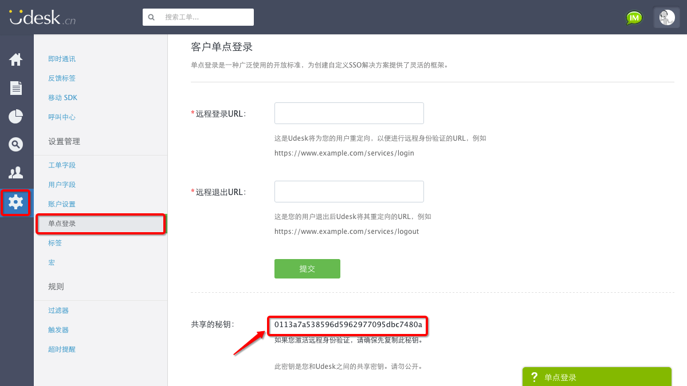
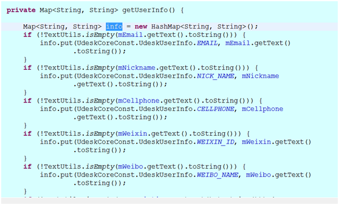
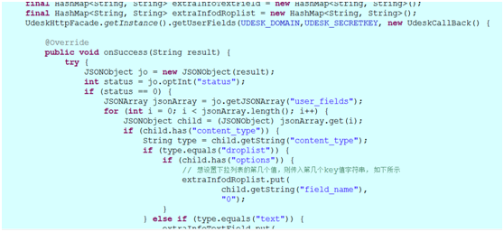
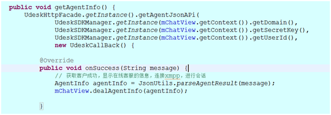
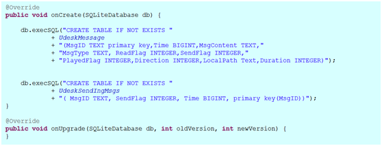

# UdeskSDK-Android
UdeskSDK-Android


##Android新版说明
> Udesk为了让开发者更好的集成移动SDK,与企业业务结合更加紧密，我们开源了SDK的UI界面。用户可以根据自身业务以及APP的不同风格重写页面。当然开发者也可以用我们提供的默认的界面。

## 1.SDK工作流程


## 2.导入Udesk SDK

1. 
2. 将所有jar包导入类库


>注：这些jar包都是必须的

## 3.修改清单配置AndroidManifest.xml 文件 

```
 <uses-permission android:name="android.permission.ACCESS_WIFI_STATE" />
    <uses-permission android:name="android.permission.INTERNET" />
    <uses-permission android:name="android.permission.READ_PHONE_STATE" />
    <uses-permission android:name="android.permission.ACCESS_NETWORK_STATE" />
    <uses-permission android:name="android.permission.WRITE_EXTERNAL_STORAGE" />
    <uses-permission android:name="android.permission.RECORD_AUDIO" />
    <uses-permission android:name="android.permission.READ_EXTERNAL_STORAGE" />

    <application>
        <activity
            android:name="cn.udesk.activity.UdeskHelperActivity"
            android:configChanges="screenSize|orientation|navigation|uiMode|keyboardHidden"
            android:theme="@style/Udesk_Theme" >
        </activity>
        <activity
            android:name="cn.udesk.activity.UdeskHelperArticleActivity"
            android:configChanges="screenSize|orientation|navigation|uiMode|keyboardHidden"
            android:theme="@style/Udesk_Theme" />
        <activity
            android:name="cn.udesk.activity.UdeskRobotActivity"
            android:configChanges="screenSize|orientation|navigation|uiMode|keyboardHidden"
            android:theme="@style/Udesk_Theme" />
        <activity
            android:name="cn.udesk.activity.UdeskFormActivity"
            android:configChanges="screenSize|orientation|navigation|uiMode|keyboardHidden"
            android:theme="@style/Udesk_Theme" />
        <activity
            android:name="cn.udesk.activity.UdeskChatActivity"
            android:configChanges="screenSize|orientation|navigation|uiMode|keyboardHidden"
            android:theme="@style/Udesk_Theme" />
        <activity
            android:name="cn.udesk.activity.UdeskZoomImageActivty"
            android:configChanges="screenSize|orientation|navigation|uiMode|keyboardHidden"
            android:theme="@style/Udesk_Theme" />

```

## 4.SDK打包混淆

在proguard-project.text文件中加入：

```
-libraryjars libs/asmack-android-8-4.0.6.jar 
-libraryjars libs/android-async-http.jar 
-libraryjars libs/android-support-v4.jar 
-libraryjars libs/qiniu-android-sdk-7.0.1.jar 
-libraryjars libs/udesk_sdkui.2.3.0.jar 
-libraryjars libs/universal-image-loader-1.9.4.jar 

-keep class com.kenai.jbosh.** {*; }
-keep class com.novell.sasl.client.** {*; }
-keep class de.measite.smack.** {*; } 
-keep class org.** {*; }

```

## 5.快速使用Udesk

使用Udesk提供的UI，须执行初始化函数、创建用户函数和调出视图函数三个步骤（必选项），其余接口为可选项。使用Udesk原生提供的UI可以省去该部分开发的时间和精力，更快速的嵌入应用。

1）.注册Udesk,替换key和domain;

首先，在Udesk官网http://udesk.udesk.cn/hc 注册，domain位置如下图：


然后，点击“进入您的Udesk”，进入管理中心—设置管理—单点登录，即可看到共享秘钥（key即共享密钥）， 详情如图示：




2）. 创建专属客服
在管理中心—客服管理—客服列表即可添加客服， 添加位置如下图：


注意：创建客服后，被添加的客服须进入邮箱验证并设置登录密码，所以务必保证添加的邮箱真实准确。

## 6.常用Activity及UI
### 常用的Activity
+ 1、UdeskChatActivity（聊天界面）
+ 2、UdeskHelperActivity（帮助界面）
+ 3、UdeskHelperArticleActivity（帮助内容界面）
### 常用UI


## 7.接口详细说明

1）初始化sdk ，将 SDK 文件添加到工程，将udesk sdk jar包拷贝到工程目录下libs文件中；

2）绑定公司的域名和密钥和添加用户自定义唯一字段，即之前在Udesk官网注册的domain和key值和用户的自定义唯一字段，在SDK中设置如下：

```
private  String UDESK_DOMAIN = "wkudesk.udesk.cn";// 在udesk平台申请的演示用域名。
private  String UDESK_SECRETKEY = "500bd56126a2940f1a13a830e0ec3faf";// udesk平台分配的演示用secret

private String sdk_Token = "xxxxxxxxx";//用户身份的唯一识别必填必须唯一

```

>注：sdk_Token是用户身份的唯一识别，必须唯一


3）绑定公司的域名和密钥后，可选设置用户的信息和自定义用户信息：
SDK 提供的可选信息有：添加用户信息和用户自定义字段
注意：若要在SDK中使用 用户自定义字段 需先在网页端设置添加用户自定义字字段。此时需要调用commitSelffield()将信息插入;如果不需要用户自定义字段则可以直接调用setUserInfo()用于用户信息初始化。
用户字段包含了一名联系人的所用数据。目前Udesk完全支持自定义用户字段，您可以选择输入型字段和选择型字段。如果是选择型字段，需要提供多个自定义的选项供您的客户进行选择。如果是输入型字段，用户会看到一个文本输入框输如数据。


>注意：用户自定义字段类型有两种方式:1:下拉列表（"droplist"）;2:文本类型（"text"）。

```

{
    "field_name": "SelectField_457", 
    "permission": 0, 
    "comment": "", 
    "requirment": true, 
    "content_type": "droplist", 
    "field_label": "test1", 
    "options": [
        {
            "0": "1"
        }, 
        {
            "1": "2"
        }, 
        {
            "2": "3"
        }, 
        {
            "3": "4"
        }
    ]
}

```

自定义字段文本类型如下所示

```

{
    "field_name": "TextField_580", 
    "permission": 0, 
    "comment": "测试文本", 
    "requirment": false, 
    "content_type": "text", 
    "field_label": "文本", 
    "options": null
}
```

4）为自定义字段添加信息
+ 下拉列表类型：首先我们要先获得”field_name”字段的字段的值作为key值，下拉列表的位置作为value值。如果想要设置第一位置的值就将value值存为”0”,依次类推第二个位置将value值存为”1”,依次类推等。
+ 文本类型：首先我们也要获得”field_name”字段的字段的值作为key值，然后将"comment"字段的值作为value值存入即可；
代码如下：


可选字段信息如下：


|参数 |说明 |参数选择 |
|--------|:------|------|
|sdktoken |客户身份的唯一识别 | 必选|
|UdeskUserInfo.NICK_NAME |用户昵称 | 可选|
|UdeskUserInfo.CELLPHONE |联系电话 | 可选|
|UdeskUserInfo.EMAIL |邮箱 | 可选|
|UdeskUserInfo.QQ  |QQ号 | 可选|
|UdeskUserInfo.WEIBO_NAME | 微博名| 可选|
|UdeskUserInfo.WIXIN_ID | 微信号 | 可选|
|UdeskUserInfo.DESCRIPTION |描述 | 可选|


使用代码demo


5）调用在线客服聊天界面，可根据不同需求进行设置并调用不同的接口，UdeskConversationArgs和UDeskSDK对这些设置提供了接口。
常用接口：
### 创建用户的接口


### 获取自定义字段获取接口


### 设置用户信息接口


### 初始化接口


### 机器人接口


### 智能客服接口


### 上传客户信息


### 获取客服状态


### 获取帮助中心接口


### 获取帮助内容接口


### 搜索帮助内容接口

>注：getDomen()获取的是公司申请的域名，getsecretKey()是公司的秘钥。

## 8.关于DB说明
目前创建两张表：udeskMessageInfo消息表和udeskSendIngMsgs发送中消息表；表消息ID是MsgID，其他字段Time，MsgContent、MsgType
ReadFlag、SendFlag、PlayedFlag、Direction、LocalPath、Duration



