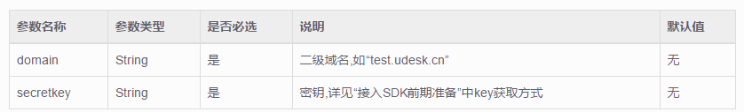
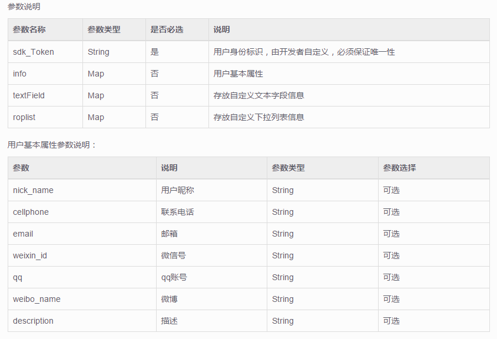

# UdeskSDK-Android
UdeskSDK-Android

##Android新版说明
> Udesk为了让开发者更好的集成移动SDK,与企业业务结合更加紧密，我们开源了SDK的UI界面。用户可以根据自身业务以及APP的不同风格重写页面。当然开发者也可以用我们提供的默认的界面。
##一、接口详细说明
> Udesk-SDK方法都封装在UdeskSDKManager类中,采用单例。通过UdeskSDKManager.getInstance().对应的方法调用。

> **特别注意：第一步必需是调用initApiKey,第二步是必需调用setUserInfo 。 其它的api的使用都必需在第一步和第二步之后,根据集成时的需求调用，否则会出错误。 如果需要在同一个域名和共享密钥下切换用户，则可跳过第一步，直接调用第二步setUserInfo()。**
##1、初始化SDK (必须调用)
####初始化SDK，传入Udesk专属域名和共享的密钥。
initApiKey(Context context,String domain, String secretKey);

> 参数说明

###2、创建用户，上传用户的信息 （必须调用）
> setUserInfo(final Context context,String sdk_Token,Map<String, String> info,Map<String, String> textField,Map<String, String> roplist);

###Info存放用户基本信息示例：
private Map<String, String> getUserInfo() {

        Map<String, String> info = new HashMap<String, String>();
        info.put(UdeskConst.UdeskUserInfo.NICK_NAME,”这是个昵称”);
        info.put(UdeskConst.UdeskUserInfo.EMAIL, "test@163.com");
        info.put(UdeskConst.UdeskUserInfo.CELLPHONE, "13800000000");
        info.put(UdeskConst.UdeskUserInfo.WEIXIN_ID, "这填写微信的ID号");
        info.put(UdeskConst.UdeskUserInfo.WEIBO_NAME, "这是微博的账号");
        info.put(UdeskConst.UdeskUserInfo.QQ, "321321321");
        info.put(UdeskConst.UdeskUserInfo.DESCRIPTION, "这填写的是描述信息");

        return info;

    }
**如果需要给用户自定义字段赋值，请先确保已在后台添加用户自定义字段，然后调用接口获取用户自定义字段，再进行赋值。**
####添加用户自定义字段 用管理员账号登录后台，在[管理中心-用户字段]中添加自定义字段。

####调用接口获取用户自定义字段并赋值。
getCustomeUserfields();

